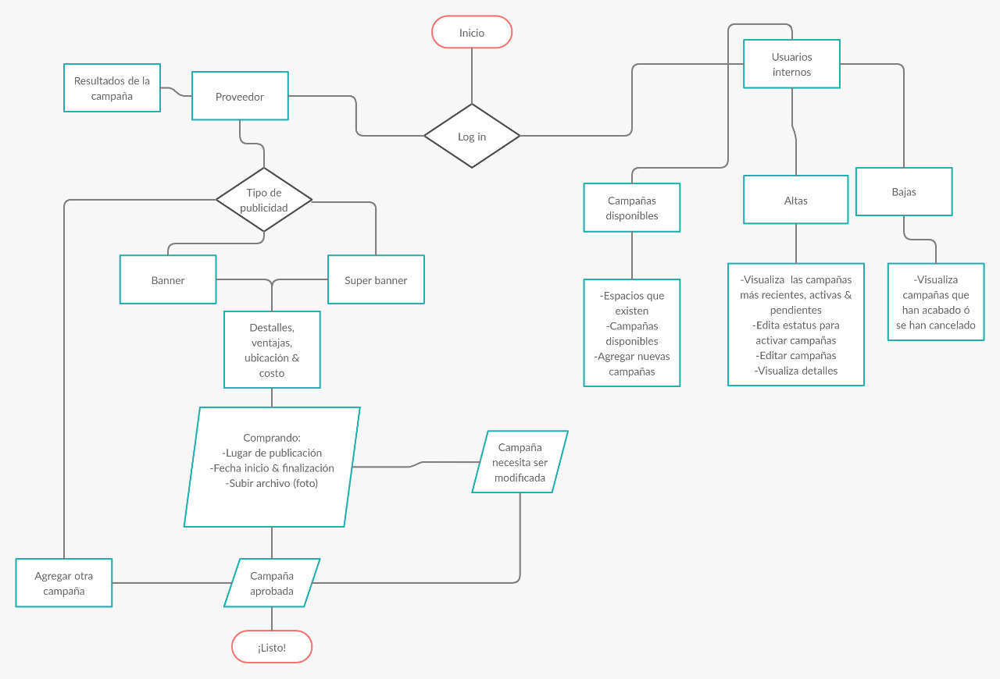
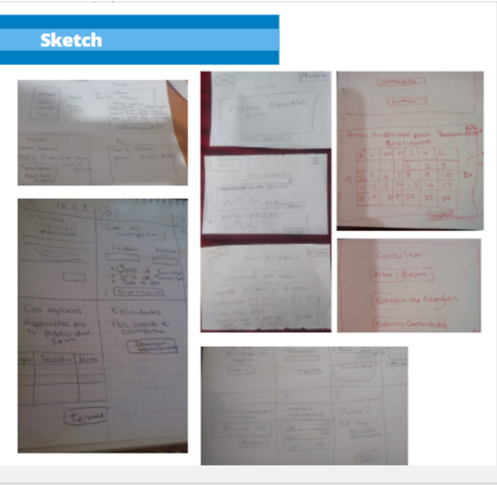

# Reto Walmart

## Sobre el negocio

Walmart de México y Centroamérica es una empresa dedicada al sector comercio. Opera en seis países: Costa Rica, El Salvador, Guatemala, Honduras, México y Nicaragua. Es una de las cadenas comerciales más importantes de la región, pues cuentan con mas de 3000 unidades laborando, incluyendo tiendas de autoservicio y clubes de precios con membresía.

Cuentan diferentes formatos, que incluyen tiendas de descuento (Bodega Aurrera Express, Despensas Familiares y Palí), supermercados (Superama, Supertiendas Paiz, La Despensa de Don Juan, La Unión y Más x Menos), bodegas (Bodega Aurrera, Mi Bodega Aurrera y Maxi Bodega), hipermercados (Walmart, Hiper Paiz e Hipermás) y clubes de precio con membresías (Sam's Club y ClubCo).

También cuenta con sus distintas tiendas en linea, donde ademas de ofrecer la venta de productos a sus miles de clientes, ofrecen a sus proveedores espacios para destacar sus productos y promocionarlos. 

## Objetivos del negocio

- Proporcionar grandes valores tanto en el sitio como en las tiendas.
- Ofrecer servicios de calidad y precios bajos todos los días.
- Superar las expectativas de los socios, clientes y proveedores.

## La problématica

Walmart al ser una gran empresa, se ha actualizado constantemente y  cuenta con distintas páginas donde realizan ventas en linea, dentro de la misma, han incluido espacios publicitarios, los cuales ofrecen unicamente a sus proveedores registrados para que anuncien y promocionen los productos de su marca.

En la actualidad ofrecen estos espacios de forma manual, esto es envían a sus proveedores la información de estas campañas a través de un PDF donde el proveedor visualiza los espacios disponibles y elige un espacio, una vez seleccionado le informa al equipo de Walmart su decisión y se inicia el proceso de contratación y alguien hace la asignación de este.

## Difícultades

Sin embargo al ser un proceso manual surgen distintas problematicas:

- El proceso es tardado, con lleva muchos pasos para poder completarlo.
- Dos proveedores distintos pueden seleccionar el mismo espacio, pues la actualización de la información no es inmediata.
- La administración de los espacios disponibles, apartados y activos, es muy complicada y debe actualizarse constantemente.
-Los proveedores pueden recibir una información con errores de disponibilidad.

## ¿Como mejorar el proceso de contratación de espacios publicitarios?

## El reto

Con el fin de mejorar la gestión y experiencia de usuarios, se pretende crear una herramienta web que permita a los proveedores apartar y comprar los espacios publicitarios deseados, así como la gestión de los mismos para los usuarios internos de Walmart.

## Objetivo del proyecto

- El proveedor pueda acceder a la plataforma por medio de un login.
- El  proveedor pueda ver los espacios disponibles
- Se pueda realizar la selección y compra del espacio publicitario.
- El usuario interno pueda acceder por medio de una cuenta.
- El usuario interno pueda dar de alta o baja las campañas contratadas.
- El usuario interno pueda consultar los espacios activos y los que están en proceso de activación.

## Diagrama de  flujo

https://app.creately.com/diagram/aeW4OduisDJ/view

## Ideación

Al iniciar la conversacion con el equipo de Walmart se logro visualizar, cuales eran las principales necesidades del proyecto, se identificaron las distintas problematica en el proceso actual y en base a las respuestas se realizo una lluvia de ideas de posibles flujos, se realizaron sketchs con distintas propuestas.

## Sketch

## WireFrame

### Liga de prototipo de baja.

https://www.figma.com/file/fd8F5gbFM5YxUYfNjDTmU3/Walmart-con-Laboratoria?node-id=0%3A1

### Liga de prototipo de alta.

https://www.figma.com/file/fd8F5gbFM5YxUYfNjDTmU3/Walmart-con-Laboratoria?node-id=1%3A2

## Solución

### Deploy

https://publicidad-walmart.web.app/

### Datos para entrar
 Correo

## Herramientas utilizadas
- Libreria React.
- Ant desing.
- Sass.
- React router dom.
- React-day-picker( Dependecias extra para implementación de calendario).
- React-firebase-file-uploader ( Dependecias extra para implementación de subir imagenes).

### Integrantes de desarrollo 
- Mariel E. Carrillo Moreno  Front End Developer
- Abigail Sánchez López      Front End Developer
- Elizabeth Flores Guillen   Front End Developer
- Karen Flores Nava          UX Designer